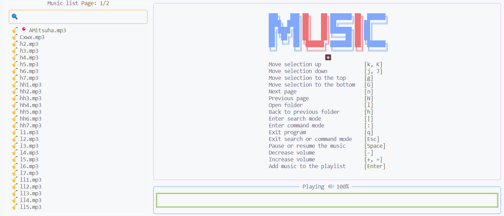
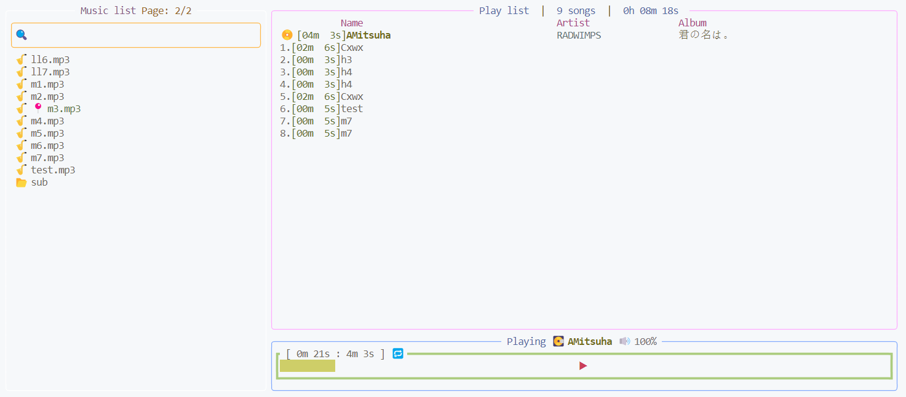

# MusicPlayer

具有较丰富页面的的音乐播放器

## 一、简介

使用Rust编写了一个终端音乐播放器，支持MP3、FLAC和WAV等音乐格式。这个播放器的界面设计类似于MP3播放器，可以在命令行终端中显示歌曲的标题、歌手和播放进度条。

## 二、部署

### （一）要求

#### 方法1：

配置文件存放在: 用户目录\\.config\music_player\config.yml

Configuration file path: ~\\.config\music_player\config.yml

如果不确定自己的路径，可以运行**dir_print**下的项目，简单输出一下自己的路径，就知道该配在哪里了

```yml
# Path to store music
# 存放音乐的路径 (默认系统音乐路径)
music_database: ''

# Color
# 主题配色
theme:
  list_title_color: '#ffaaff'
  list_title_page_color: '#ffb747'
  list_border_color: '#ffffff'
  list_music_color: '#eee4c4'
  list_folder_color: '#eee4c4'
  list_icon_color: '#f07178'
  list_selected_color: '#c3e88d'
  search_border_color: '#ffb747'
  search_icon_color: '#ec998b'
  search_font_color: '#eee4c4'
  command_font_color: '#eee4c4'
  command_border_color: '#c3eead'
  music_pic_color1: '#f07178'
  music_pic_color2: '#81a8fd'
  usage_color_left: '#beb2ec'
  usage_color_right: '#eee188'
  cut_off_rule_color: '#c3e88d'
  play_music_list_title_color: '#81a8fd'
  play_music_list_border_color: '#ffaaff'
  play_music_list_id_color: '#e0d7ca'
  play_music_list_duration_color: '#a9c34f'
  play_music_list_name_color: '#eee4c4'
  play_music_list_artist_color: '#b2e2e4'
  play_music_list_album_color: '#eee188'
  play_music_list_header_color: '#d15aa7'
  playing_music_border_color: '#81a8fd'
  playing_music_name_color: '#d8ce2e'
  volume_icon_color: '#9998af'
  volume_value_color: '#dcd8da'
  gauge_color: '#cece68'
  gauge_border_color: '#abcc7e'
  gauge_label_color: '#fa4d70'
```

#### 方法2：

修改config下mod.rs中的``default_init_config``中的``music_database``

### （二）运行

``
cargo build
``

``
cargo run
``

## 三、功能运行

### （一）实现的功能

1.音乐库列表。要播放歌曲列表。正在播放歌曲进度条。

2.歌曲前跳、后跳，切换。歌曲音量。

3.三种操作模式

（1）普通键盘输入的浏览模式

（2）按|，进入搜索模式

（3）按：，进入命令模式

#### 浏览模式

| 描述                     | 事件                  |
| ------------------------ | ---------------------- |
| 退出程序                 | q                      |
| 下移 1                   | j \| \<Down Arrow Key> |
| 上移 1                   | k \| \<Up Arrow Key>   |
| 下移 5                   | J                      |
| 上移 5                   | K                      |
| 移动到页面顶             | g                      |
| 移动到页面底             | G                      |
| 下一页                   | n                      |
| 上一页                   | N                      |
| 打开文件夹               | l                      |
| 返回上一文件夹           | h                      |
| 进入命令模式             | :                      |
| 进入搜索模式             | \|                     |
| 退出命令\|搜索模式       | \<Esc>                 |
| 暂停\|继续               | \<Space>               |
| 增加音量                 | + \| =                 |
| 减少音量                 | -                      |
| 加入当前歌曲到待播放列表 | \<Enter>               |

### 命令模式

| 描述                                  | 命令           |
| ------------------------------------- | ----------------- |
| 将当前目录下的所有歌曲添加到播放列表   | all               |
| 从播放列表中移除指定歌曲（可指定多首） | rm \<music_id>    |
| 从播放列表中删除所有歌曲               | clear \| cls      |
| 播放整个播放列表（Repeat: on）        | order \| od       |
| 重复播放当前歌曲 (Repeat: off)        | singlecycle \| sc |
| 随机播放当前播放列表                  | shuffle \| sh     |
| 播放播放列表中的下一首歌曲            | next \| n         |

### （二）运行截图





## 四、总结

### （一）tui库

tui是Rust语言中的一个库，全称为“Terminal User Interface”，它提供了一种简单的方式来在终端中创建用户界面。


使用tui库可以用来创建类似MP3播放器的用户界面，包括播放列表、歌曲信息、进度条等。

tui库提供了一些基本的UI组件，例如窗口、面板、文本框、按钮、列表等。这些组件可以用来创建复杂的用户界面，以便用户可以方便地控制音乐播放器。

tui库支持终端的颜色和样式。这意味着可以使用tui库来创建具有自定义颜色和样式的用户界面，以便更好地匹配音乐播放器的主题。

### （二）crossterm

Crossterm是Rust语言中的一个库，它提供了一种跨平台的方式来处理终端和控制台的输入和输出。Crossterm库可以用于创建各种类型的终端应用程序。

Crossterm库可以用来处理终端的输入和输出，以便用户可以方便地控制音乐播放器。

Crossterm库支持跨平台。这意味着可以使用Crossterm库来创建具有相同功能和外观的终端应用程序，而不必担心不同操作系统之间的差异。

## 五、改进方向

1.增加登录功能

2.增加更换主题功能
